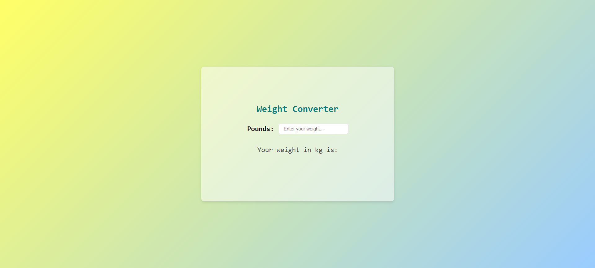

# 🟨 Weight Converter App

## 📸 Screenshot

## 🎞️ Demo

---

## 📖 Overview
The **Weight Converter App** is a lightweight and user-friendly tool that converts weights from **pounds to kilograms** in real-time. Built using HTML, CSS, and JavaScript, the application features smooth input handling, error checking, and automatic result reset to maintain a clean UI.

---

## ✨ Features
- 🔁 Real-time conversion from pounds to kilograms  
- ❌ Error display for invalid or negative inputs  
- ⏱️ Auto-clears result after 10 seconds  
- 🎨 Clean and responsive user interface  
- 📱 Mobile-friendly layout

---

## 🛠️ Technologies Used
- HTML5  
- CSS3 (Flexbox, animations, gradients)  
- JavaScript (Vanilla)

---

## 🌱 Future Enhancements
- Add reverse conversion (kg ➝ lbs)  
- Support for grams, ounces, and other units  
- Conversion history log  
- Voice input for accessibility  
- Mobile app version using React Native

---

## 🔗 Live Demo  
Coming soon...
